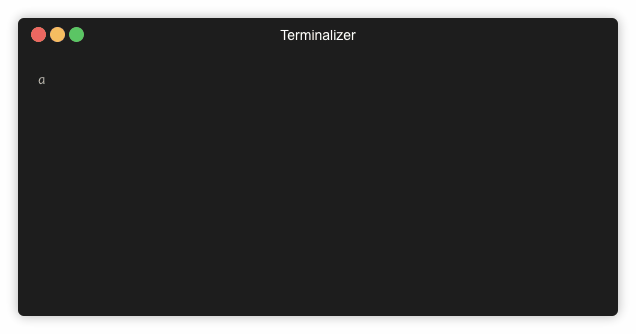

# Amplify Template
An easy way to add custom CloudFormation templates to your Amplify Project

## Installation

This plugin assumes that the Amplify CLI is already installed. For installation help, please see step 2 of the [getting-started docs](https://aws-amplify.github.io/docs/).

To install, simply enter the following command in your terminal:

`npm i -g amplify-category-template`

## Usage

| Command                      | Description |
| ---------------------------- | ----------- |
| `amplify add template`       | Adds an existing CloudFormation template that you select to your project. Today this only supports root templates ending in `yaml`, `json` or `yml`|
| `amplify remove template`    | Removes a specified template from your project. |

